# Introduction

如下图所示为Linux的系统家族树：

一个简单的指令：du。

```
yejiu97@DESKTOP-S9ODFEQ:/mnt/c/Users/yinia/Desktop/WSL$ du
0
```

Unix的后代：

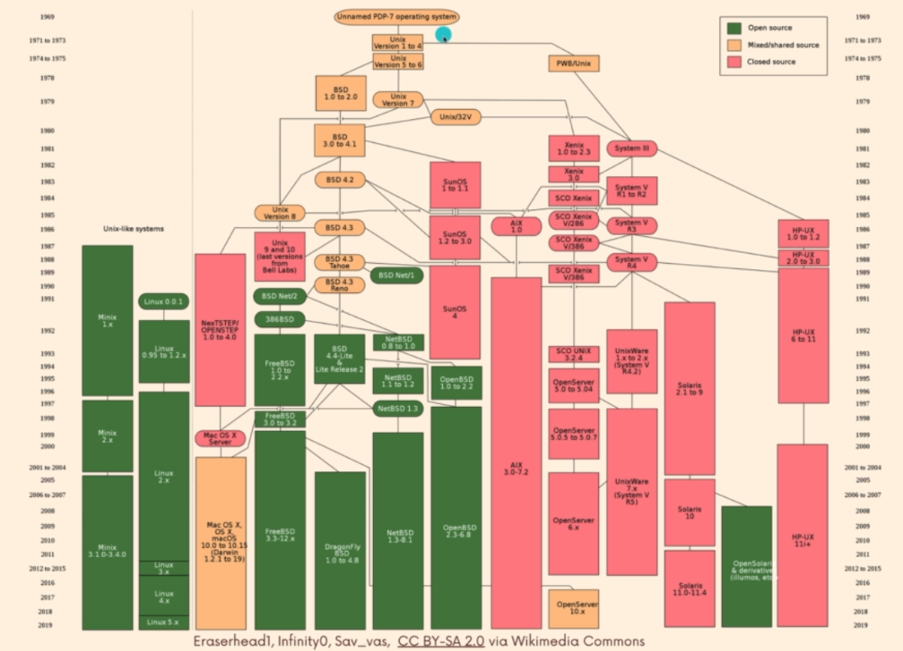

Linux的kernel：


什么是Kernel：


# Command Basics

## Open Terminal

任何一个系统都应该提供了类似的一个终端：

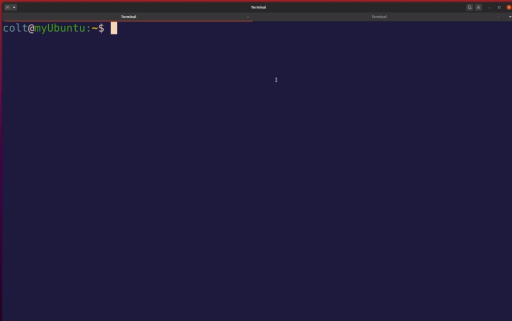

可以按Ctrl+ALT+T来打开。

## Some Commands

首先使用的是date指令，这个指令会返回系统的时间：

```
yejiu97@DESKTOP-S9ODFEQ:/mnt/c/Users/yinia/Desktop/WSL$ date
Mon Dec 19 17:46:48 ACDT 2022
```

接着我们可以使用clear来清楚已经打印了的东西：

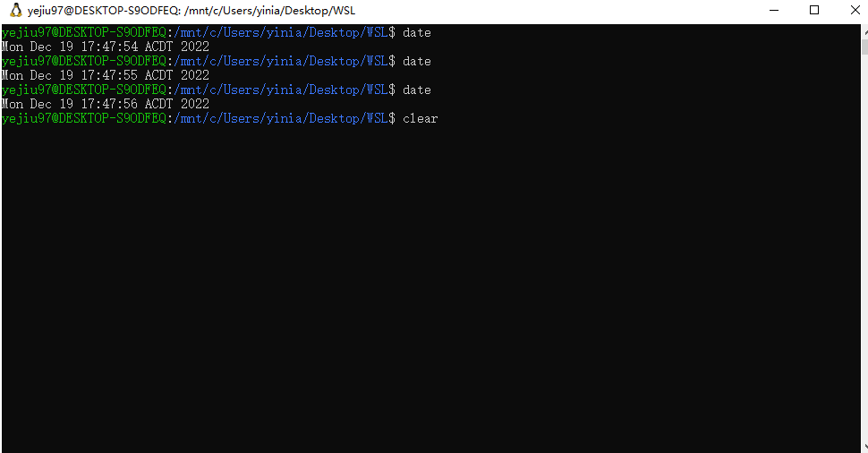

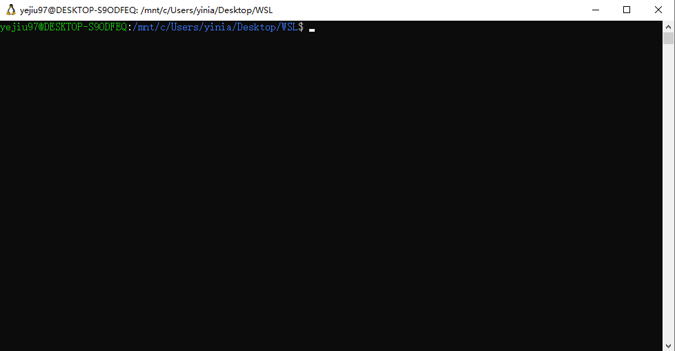

需要注意的地方在于date和Date是不同的：

```
yejiu97@DESKTOP-S9ODFEQ:/mnt/c/Users/yinia/Desktop/WSL$ date
Mon Dec 19 17:48:44 ACDT 2022
yejiu97@DESKTOP-S9ODFEQ:/mnt/c/Users/yinia/Desktop/WSL$ Date
Command 'Date' not found, did you mean:
  command 'date' from deb coreutils (8.32-4.1ubuntu1)
  command 'late' from deb late (0.1.0-14)
  command 'kate' from deb kate (4:21.12.3-0ubuntu1)
Try: sudo apt install <deb name>
```

可以发现没有Date这个指令，linux会推荐一些相关联的指令。

另一个简单的指令是ncal：

```
yejiu97@DESKTOP-S9ODFEQ:/mnt/c/Users/yinia/Desktop/WSL$ ncal
    December 2022
Su     4 11 18 25
Mo     5 12 19 26
Tu     6 13 20 27
We     7 14 21 28
Th  1  8 15 22 29
Fr  2  9 16 23 30
Sa  3 10 17 24 31
```

## Command Structure

指令的结构如下所示：


以echo为例子：

```
yejiu97@DESKTOP-S9ODFEQ:/mnt/c/Users/yinia/Desktop/WSL$ echo "Hello World"
Hello World
yejiu97@DESKTOP-S9ODFEQ:/mnt/c/Users/yinia/Desktop/WSL$ echo hello world
hello world
```

尝试一下ncal：

```
yejiu97@DESKTOP-S9ODFEQ:/mnt/c/Users/yinia/Desktop/WSL$ ncal 2021
                                  2021
    January           February          March             April
Su     3 10 17 24 31     7 14 21 28        7 14 21 28        4 11 18 25
Mo     4 11 18 25     1  8 15 22        1  8 15 22 29        5 12 19 26
Tu     5 12 19 26     2  9 16 23        2  9 16 23 30        6 13 20 27
We     6 13 20 27     3 10 17 24        3 10 17 24 31        7 14 21 28
Th     7 14 21 28     4 11 18 25        4 11 18 25        1  8 15 22 29
Fr  1  8 15 22 29     5 12 19 26        5 12 19 26        2  9 16 23 30
Sa  2  9 16 23 30     6 13 20 27        6 13 20 27        3 10 17 24

    May               June              July              August
Su     2  9 16 23 30     6 13 20 27        4 11 18 25     1  8 15 22 29
Mo     3 10 17 24 31     7 14 21 28        5 12 19 26     2  9 16 23 30
Tu     4 11 18 25     1  8 15 22 29        6 13 20 27     3 10 17 24 31
We     5 12 19 26     2  9 16 23 30        7 14 21 28     4 11 18 25
Th     6 13 20 27     3 10 17 24        1  8 15 22 29     5 12 19 26
Fr     7 14 21 28     4 11 18 25        2  9 16 23 30     6 13 20 27
Sa  1  8 15 22 29     5 12 19 26        3 10 17 24 31     7 14 21 28

    September         October           November          December
Su     5 12 19 26        3 10 17 24 31     7 14 21 28        5 12 19 26
Mo     6 13 20 27        4 11 18 25     1  8 15 22 29        6 13 20 27
Tu     7 14 21 28        5 12 19 26     2  9 16 23 30        7 14 21 28
We  1  8 15 22 29        6 13 20 27     3 10 17 24        1  8 15 22 29
Th  2  9 16 23 30        7 14 21 28     4 11 18 25        2  9 16 23 30
Fr  3 10 17 24        1  8 15 22 29     5 12 19 26        3 10 17 24 31
Sa  4 11 18 25        2  9 16 23 30     6 13 20 27        4 11 18 25
```

或者我们增加一个参数：

```
yejiu97@DESKTOP-S9ODFEQ:/mnt/c/Users/yinia/Desktop/WSL$ ncal 2024
                                  2024
    January           February          March             April
Su     7 14 21 28        4 11 18 25        3 10 17 24 31     7 14 21 28
Mo  1  8 15 22 29        5 12 19 26        4 11 18 25     1  8 15 22 29
Tu  2  9 16 23 30        6 13 20 27        5 12 19 26     2  9 16 23 30
We  3 10 17 24 31        7 14 21 28        6 13 20 27     3 10 17 24
Th  4 11 18 25        1  8 15 22 29        7 14 21 28     4 11 18 25
Fr  5 12 19 26        2  9 16 23        1  8 15 22 29     5 12 19 26
Sa  6 13 20 27        3 10 17 24        2  9 16 23 30     6 13 20 27

    May               June              July              August
Su     5 12 19 26        2  9 16 23 30     7 14 21 28        4 11 18 25
Mo     6 13 20 27        3 10 17 24     1  8 15 22 29        5 12 19 26
Tu     7 14 21 28        4 11 18 25     2  9 16 23 30        6 13 20 27
We  1  8 15 22 29        5 12 19 26     3 10 17 24 31        7 14 21 28
Th  2  9 16 23 30        6 13 20 27     4 11 18 25        1  8 15 22 29
Fr  3 10 17 24 31        7 14 21 28     5 12 19 26        2  9 16 23 30
Sa  4 11 18 25        1  8 15 22 29     6 13 20 27        3 10 17 24 31

    September         October           November          December
Su  1  8 15 22 29        6 13 20 27        3 10 17 24     1  8 15 22 29
Mo  2  9 16 23 30        7 14 21 28        4 11 18 25     2  9 16 23 30
Tu  3 10 17 24        1  8 15 22 29        5 12 19 26     3 10 17 24 31
We  4 11 18 25        2  9 16 23 30        6 13 20 27     4 11 18 25
Th  5 12 19 26        3 10 17 24 31        7 14 21 28     5 12 19 26
Fr  6 13 20 27        4 11 18 25        1  8 15 22 29     6 13 20 27
Sa  7 14 21 28        5 12 19 26        2  9 16 23 30     7 14 21 28

yejiu97@DESKTOP-S9ODFEQ:/mnt/c/Users/yinia/Desktop/WSL$ ncal April 2024
    April 2024
Su     7 14 21 28
Mo  1  8 15 22 29
Tu  2  9 16 23 30
We  3 10 17 24
Th  4 11 18 25
Fr  5 12 19 26
Sa  6 13 20 27
```

可以发现我们可以指定某一年的某一个月。

有一个名为colours的txt文件：

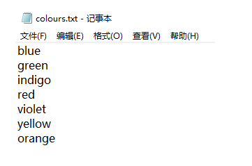

接着我们来使用sort指令，并且给出这个文件名作为参数：

```
yejiu97@DESKTOP-S9ODFEQ:/mnt/c/Users/yinia/Desktop/WSL/03$ ls
colours.txt
yejiu97@DESKTOP-S9ODFEQ:/mnt/c/Users/yinia/Desktop/WSL/03$ sort colours.txt
blue
green
indigo
orange
red
violet
yellow
```

接着我们来使用rm来移除文件：

```
yejiu97@DESKTOP-S9ODFEQ:/mnt/c/Users/yinia/Desktop/WSL/03$ ls
colours.txt
yejiu97@DESKTOP-S9ODFEQ:/mnt/c/Users/yinia/Desktop/WSL/03$ rm colours.txt
yejiu97@DESKTOP-S9ODFEQ:/mnt/c/Users/yinia/Desktop/WSL/03$ ls
yejiu97@DESKTOP-S9ODFEQ:/mnt/c/Users/yinia/Desktop/WSL/03$
```

# Getting Help

## Get Help

如果我不确定某一个指令是怎么用的，可以使用man指令来调查：

```
CAL(1)                                       BSD General Commands Manual                                       CAL(1)

NAME
     cal, ncal — displays a calendar and the date of Easter

SYNOPSIS
     cal [-3hjy] [-A number] [-B number] [[month] year]
     cal [-3hj] [-A number] [-B number] -m month [year]
     ncal [-3bhjJpwySM] [-A number] [-B number] [-W number] [-s country_code] [[month] year]
     ncal [-Jeo] [-A number] [-B number] [year]
     ncal [-CN] [-H yyyy-mm-dd] [-d yyyy-mm]

DESCRIPTION
     The cal utility displays a simple calendar in traditional format and ncal offers an alternative layout, more op‐
     tions and the date of Easter.  The new format is a little cramped but it makes a year fit on a 25x80 terminal.
     If arguments are not specified, the current month is displayed.

     The options are as follows:

     -h      Turns off highlighting of today.

     -J      Display Julian Calendar, if combined with the -o option, display date of Orthodox Easter according to
             the Julian Calendar.

     -e      Display date of Easter (for western churches).

     -j      Display Julian days (days one-based, numbered from January 1).

     -m month
```

这个是：

```
man ncal
```

的结果。

同样的，我们可以查看date之类的结果：

```
DATE(1)                                             User Commands                                             DATE(1)

NAME
       date - print or set the system date and time

SYNOPSIS
       date [OPTION]... [+FORMAT]
       date [-u|--utc|--universal] [MMDDhhmm[[CC]YY][.ss]]

DESCRIPTION
       Display the current time in the given FORMAT, or set the system date.

       Mandatory arguments to long options are mandatory for short options too.

       -d, --date=STRING
              display time described by STRING, not 'now'

       --debug
              annotate the parsed date, and warn about questionable usage to stderr

       -f, --file=DATEFILE
              like --date; once for each line of DATEFILE

       -I[FMT], --iso-8601[=FMT]
              output date/time in ISO 8601 format.  FMT='date' for date only (the default), 'hours', 'minutes', 'sec‐
              onds', or 'ns' for date and time to the indicated precision.  Example: 2006-08-14T02:34:56-06:00

       -R, --rfc-email
              output date and time in RFC 5322 format.  Example: Mon, 14 Aug 2006 02:34:56 -0600
```

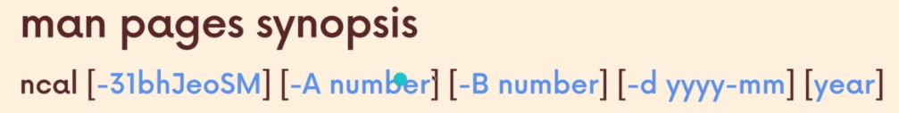

我们可以使用一下给出来的提示：

```
yejiu97@DESKTOP-S9ODFEQ:/mnt/c/Users/yinia/Desktop/WSL/03$ ncal -d 1969-08
    August 1969
Su     3 10 17 24 31
Mo     4 11 18 25
Tu     5 12 19 26
We     6 13 20 27
Th     7 14 21 28
Fr  1  8 15 22 29
Sa  2  9 16 23 30
```

## type 和 which

使用type来查看一下：

```
yejiu97@DESKTOP-S9ODFEQ:/mnt/c/Users/yinia/Desktop/WSL/03$ type clear
clear is hashed (/usr/bin/clear)
```

usr之下的bin中，bin是binary的缩写，这意味着clear是可执行文件。

接着是查看一下cd：

```
yejiu97@DESKTOP-S9ODFEQ:/mnt/c/Users/yinia/Desktop/WSL/03$ type cd
cd is a shell builtin
```

从结果来看，cd不是一个binary可执行文件，而是一个shell函数。

which的逻辑和type是类似的。

## help指令

我们可以测试一下cd：

```
yejiu97@DESKTOP-S9ODFEQ:/mnt/c/Users/yinia/Desktop/WSL/03$ help cd
cd: cd [-L|[-P [-e]] [-@]] [dir]
    Change the shell working directory.

    Change the current directory to DIR.  The default DIR is the value of the
    HOME shell variable.

    The variable CDPATH defines the search path for the directory containing
    DIR.  Alternative directory names in CDPATH are separated by a colon (:).
    A null directory name is the same as the current directory.  If DIR begins
    with a slash (/), then CDPATH is not used.

    If the directory is not found, and the shell option `cdable_vars' is set,
    the word is assumed to be  a variable name.  If that variable has a value,
    its value is used for DIR.

    Options:
      -L        force symbolic links to be followed: resolve symbolic
                links in DIR after processing instances of `..'
      -P        use the physical directory structure without following
                symbolic links: resolve symbolic links in DIR before
                processing instances of `..'
      -e        if the -P option is supplied, and the current working
                directory cannot be determined successfully, exit with
                a non-zero status
      -@        on systems that support it, present a file with extended
                attributes as a directory containing the file attributes

    The default is to follow symbolic links, as if `-L' were specified.
    `..' is processed by removing the immediately previous pathname component
    back to a slash or the beginning of DIR.

    Exit Status:
    Returns 0 if the directory is changed, and if $PWD is set successfully when
    -P is used; non-zero otherwise.
```

## 其他

如果要知道自己是谁，或者说这个账户是谁，可以使用whoami：

```
yejiu97@DESKTOP-S9ODFEQ:/mnt/c/Users/yinia/Desktop/WSL/03$ whoami
yejiu97
```

# Navigation

如下图所示为文件结构：

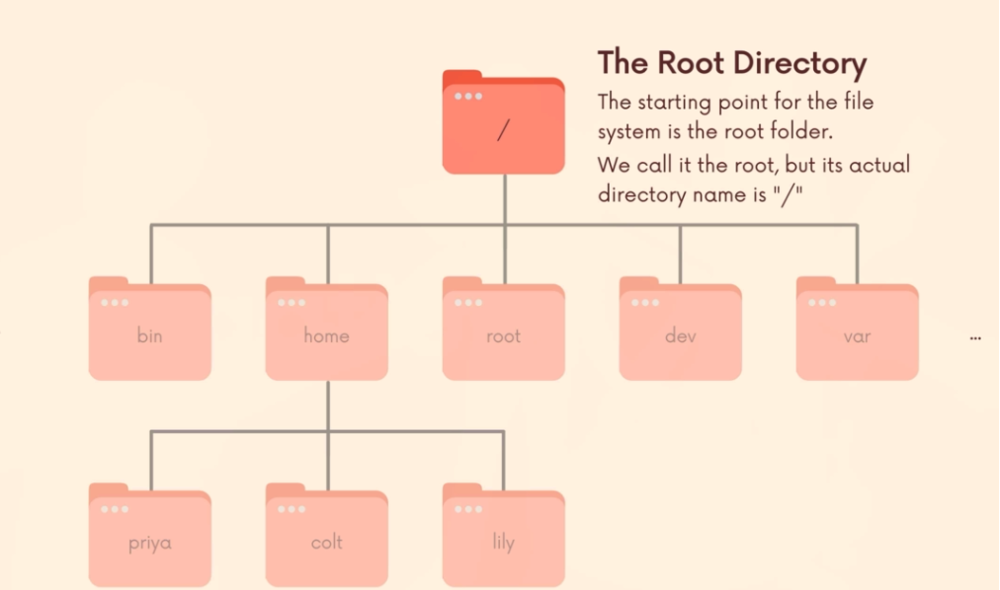

我们可以使用pwd来查看当前的文件的路径：

```
yejiu97@DESKTOP-S9ODFEQ:/mnt/c/Users/yinia/Desktop/WSL$ pwd
/mnt/c/Users/yinia/Desktop/WSL
```

这个结果是因为我现在使用的是windows subsystem linux。

ls可以罗列出当前的目录之下的文件：

```
yejiu97@DESKTOP-S9ODFEQ:/mnt/c/Users/yinia/Desktop/WSL$ touch hello.txt
yejiu97@DESKTOP-S9ODFEQ:/mnt/c/Users/yinia/Desktop/WSL$ ls
03  hello.txt
```

ls的可选项如下所示：


运行如下所示：

```
yejiu97@DESKTOP-S9ODFEQ:/mnt/c/Users/yinia/Desktop/WSL$ ls
03  hello.txt
yejiu97@DESKTOP-S9ODFEQ:/mnt/c/Users/yinia/Desktop/WSL$ ls -l
total 0
drwxrwxrwx 1 yejiu97 yejiu97 4096 Dec 19 17:58 03
-rwxrwxrwx 1 yejiu97 yejiu97    0 Dec 19 18:34 hello.txt
yejiu97@DESKTOP-S9ODFEQ:/mnt/c/Users/yinia/Desktop/WSL$ ls -a
.  ..  03  hello.txt
yejiu97@DESKTOP-S9ODFEQ:/mnt/c/Users/yinia/Desktop/WSL$ ls -la
total 0
drwxrwxrwx 1 yejiu97 yejiu97 4096 Dec 19 18:34 .
drwxrwxrwx 1 yejiu97 yejiu97 4096 Dec 19 14:55 ..
drwxrwxrwx 1 yejiu97 yejiu97 4096 Dec 19 17:58 03
-rwxrwxrwx 1 yejiu97 yejiu97    0 Dec 19 18:34 hello.txt
```

## cd

cd为change directory的缩写：

```
yejiu97@DESKTOP-S9ODFEQ:/mnt/c/Users/yinia/Desktop/WSL$ ls
03  hello.txt
yejiu97@DESKTOP-S9ODFEQ:/mnt/c/Users/yinia/Desktop/WSL$ cd 03
yejiu97@DESKTOP-S9ODFEQ:/mnt/c/Users/yinia/Desktop/WSL/03$ ls
yejiu97@DESKTOP-S9ODFEQ:/mnt/c/Users/yinia/Desktop/WSL/03$
```

我们可以使用cd..来回到上一层的目录：

```
yejiu97@DESKTOP-S9ODFEQ:/mnt/c/Users/yinia/Desktop/WSL$ ls
03  hello.txt
yejiu97@DESKTOP-S9ODFEQ:/mnt/c/Users/yinia/Desktop/WSL$ cd 03
yejiu97@DESKTOP-S9ODFEQ:/mnt/c/Users/yinia/Desktop/WSL/03$ ls
yejiu97@DESKTOP-S9ODFEQ:/mnt/c/Users/yinia/Desktop/WSL/03$ cd ..
yejiu97@DESKTOP-S9ODFEQ:/mnt/c/Users/yinia/Desktop/WSL$ ls
03  hello.txt
```

# Creating files & folders

## touch 和 mkdir

touch指令用来创建文件，而midir用来创建文件夹：

```
yinia@DESKTOP-S9ODFEQ MINGW64 ~/Desktop/WSL
$ ls
03/  hello.txt

yinia@DESKTOP-S9ODFEQ MINGW64 ~/Desktop/WSL
$ touch sayHi.txt

yinia@DESKTOP-S9ODFEQ MINGW64 ~/Desktop/WSL
$ ls
03/  hello.txt  sayHi.txt

yinia@DESKTOP-S9ODFEQ MINGW64 ~/Desktop/WSL
$ mkdir 04

yinia@DESKTOP-S9ODFEQ MINGW64 ~/Desktop/WSL
$ ls
03/  04/  hello.txt  sayHi.txt

yinia@DESKTOP-S9ODFEQ MINGW64 ~/Desktop/WSL
$
```

## file指令

file指令如下所示：

```
yejiu97@DESKTOP-S9ODFEQ:/mnt/c/Users/yinia/Desktop/WSL$ ls
03  04  hello.txt  sayHi.txt
yejiu97@DESKTOP-S9ODFEQ:/mnt/c/Users/yinia/Desktop/WSL$ file hello.txt
hello.txt: empty
```

# Nano

Nano可以用来修改文件中的内容：

```
yejiu97@DESKTOP-S9ODFEQ:/mnt/c/Users/yinia/Desktop/WSL$ cat hello.txt
Hello Worldyejiu97@DESKTOP-S9ODFEQ:/mnt/c/Users/yinia/Desktop/WSL$ nano
yejiu97@DESKTOP-S9ODFEQ:/mnt/c/Users/yinia/Desktop/WSL$ nano hello.txt
yejiu97@DESKTOP-S9ODFEQ:/mnt/c/Users/yinia/Desktop/WSL$ cat hello.txt
Hello World
Say Hi~
```

我们可以使用：

```
nano +LineNumber File
```

用来打开指定的文件的指定行。

使用Ctrl+O可以用来存储我们的内容，如果不需要修改文件的名称的话，直接enter就可以了。

其他的操作如下所示：


# Deleting, Copying, & Moving

rm可以用来删除文件或者文件夹，操作如下所示：

```
yejiu97@DESKTOP-S9ODFEQ:/mnt/c/Users/yinia/Desktop/WSL$ ls
03  04  hello.txt  sayHi.txt
yejiu97@DESKTOP-S9ODFEQ:/mnt/c/Users/yinia/Desktop/WSL$ rm hello.txt
yejiu97@DESKTOP-S9ODFEQ:/mnt/c/Users/yinia/Desktop/WSL$ ls
03  04  sayHi.txt
```

如果我们需要喊出的是文件夹的话：

```
yejiu97@DESKTOP-S9ODFEQ:/mnt/c/Users/yinia/Desktop/WSL$ ls
03  04  sayHi.txt
yejiu97@DESKTOP-S9ODFEQ:/mnt/c/Users/yinia/Desktop/WSL$ rm 03
rm: cannot remove '03': Is a directory
yejiu97@DESKTOP-S9ODFEQ:/mnt/c/Users/yinia/Desktop/WSL$ rm -rf 03
yejiu97@DESKTOP-S9ODFEQ:/mnt/c/Users/yinia/Desktop/WSL$ ls
04  sayHi.txt
```

如果我们需要大量的删除同一个类型的文件：

```
yejiu97@DESKTOP-S9ODFEQ:/mnt/c/Users/yinia/Desktop/WSL$ ls
04  sayHi.txt
yejiu97@DESKTOP-S9ODFEQ:/mnt/c/Users/yinia/Desktop/WSL$ touch 1.txt 2.txt 3.txt
yejiu97@DESKTOP-S9ODFEQ:/mnt/c/Users/yinia/Desktop/WSL$ ls
04  1.txt  2.txt  3.txt  sayHi.txt
yejiu97@DESKTOP-S9ODFEQ:/mnt/c/Users/yinia/Desktop/WSL$ rm *.txt
yejiu97@DESKTOP-S9ODFEQ:/mnt/c/Users/yinia/Desktop/WSL$ ls
04
```

可以发现所有的后缀为txt的文件都已经被删除了。

我们可以使用mv来移动文件：

```
yejiu97@DESKTOP-S9ODFEQ:/mnt/c/Users/yinia/Desktop/WSL$ ls
04
yejiu97@DESKTOP-S9ODFEQ:/mnt/c/Users/yinia/Desktop/WSL$ touch 1.txt
yejiu97@DESKTOP-S9ODFEQ:/mnt/c/Users/yinia/Desktop/WSL$ mv 1.txt 04
yejiu97@DESKTOP-S9ODFEQ:/mnt/c/Users/yinia/Desktop/WSL$ ls
04
yejiu97@DESKTOP-S9ODFEQ:/mnt/c/Users/yinia/Desktop/WSL$ cd 04
yejiu97@DESKTOP-S9ODFEQ:/mnt/c/Users/yinia/Desktop/WSL/04$ ls
1.txt
yejiu97@DESKTOP-S9ODFEQ:/mnt/c/Users/yinia/Desktop/WSL/04$ mv 1.txt ./..
yejiu97@DESKTOP-S9ODFEQ:/mnt/c/Users/yinia/Desktop/WSL/04$ ls
yejiu97@DESKTOP-S9ODFEQ:/mnt/c/Users/yinia/Desktop/WSL/04$ cd ..
yejiu97@DESKTOP-S9ODFEQ:/mnt/c/Users/yinia/Desktop/WSL$ ls
04  1.txt
```

我们可以使用mv来完成改名的操作：

```
yejiu97@DESKTOP-S9ODFEQ:/mnt/c/Users/yinia/Desktop/WSL$ ls
04  1.txt
yejiu97@DESKTOP-S9ODFEQ:/mnt/c/Users/yinia/Desktop/WSL$ mv 1.txt 2.txt
yejiu97@DESKTOP-S9ODFEQ:/mnt/c/Users/yinia/Desktop/WSL$ ls
04  2.txt
```

我们可以使用cp来进行复制：

```
yejiu97@DESKTOP-S9ODFEQ:/mnt/c/Users/yinia/Desktop/WSL$ ls
04  2.txt
yejiu97@DESKTOP-S9ODFEQ:/mnt/c/Users/yinia/Desktop/WSL$ cp 2.txt 2_cp.txt
yejiu97@DESKTOP-S9ODFEQ:/mnt/c/Users/yinia/Desktop/WSL$ ls
04  2.txt  2_cp.txt
```

以及：

```
yejiu97@DESKTOP-S9ODFEQ:/mnt/c/Users/yinia/Desktop/WSL$ ls
04  2.txt
yejiu97@DESKTOP-S9ODFEQ:/mnt/c/Users/yinia/Desktop/WSL$ cp 2.txt 2_cp.txt
yejiu97@DESKTOP-S9ODFEQ:/mnt/c/Users/yinia/Desktop/WSL$ ls
04  2.txt  2_cp.txt
yejiu97@DESKTOP-S9ODFEQ:/mnt/c/Users/yinia/Desktop/WSL$ cp 2.txt ./04/2_04_cp.txt
yejiu97@DESKTOP-S9ODFEQ:/mnt/c/Users/yinia/Desktop/WSL$ ls
04  2.txt  2_cp.txt
yejiu97@DESKTOP-S9ODFEQ:/mnt/c/Users/yinia/Desktop/WSL$ cd 04
yejiu97@DESKTOP-S9ODFEQ:/mnt/c/Users/yinia/Desktop/WSL/04$ ls
2_04_cp.txt
yejiu97@DESKTOP-S9ODFEQ:/mnt/c/Users/yinia/Desktop/WSL/04$ cd ..
yejiu97@DESKTOP-S9ODFEQ:/mnt/c/Users/yinia/Desktop/WSL$ ls
04  2.txt  2_cp.txt
```

# Shortcuts & History


# Working With Files

less file会将file中的内容显示出来，一次显示一页的内容。

对于特别大的文本，使用less会比只用cat来的更加的有用。

例子：

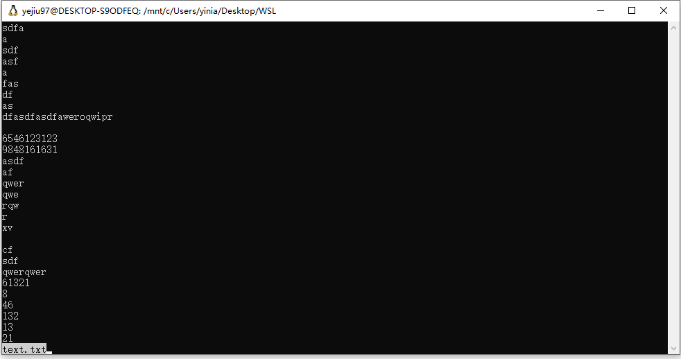

按f之后，进入到下一页：

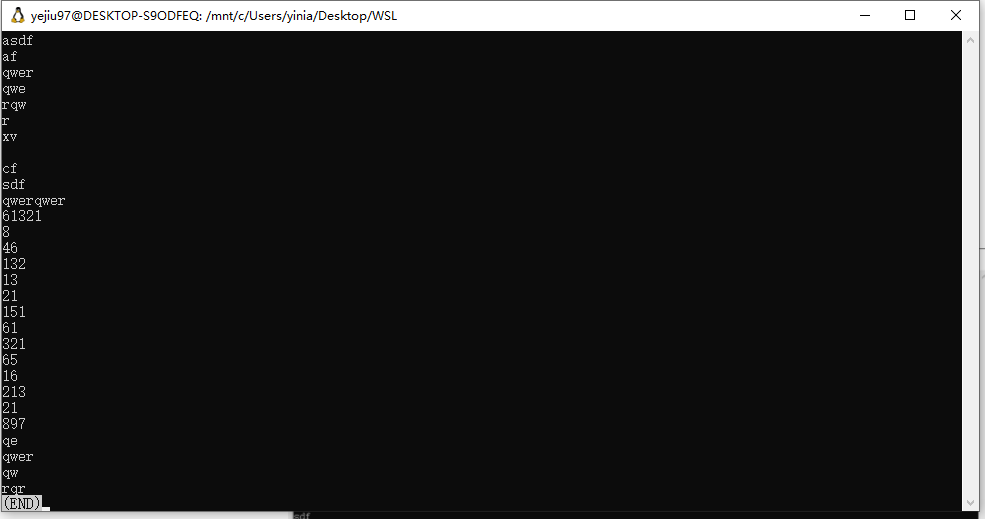

按b可以回到上一页：

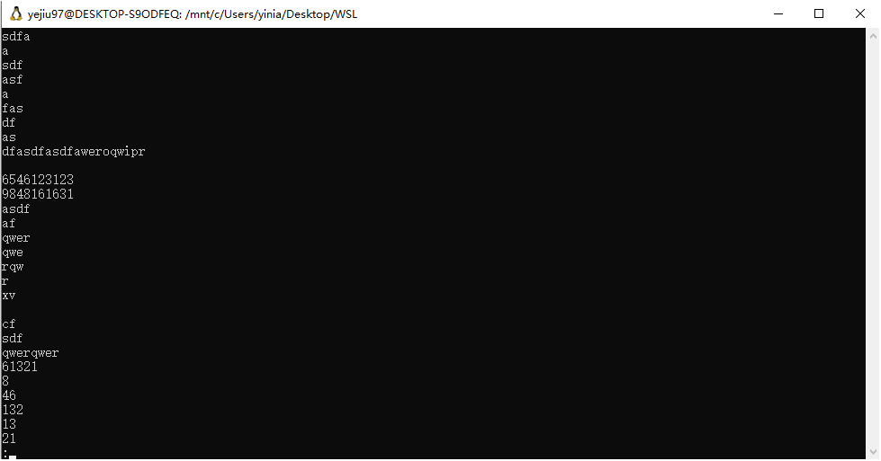

每按一次可以往下移动一行：

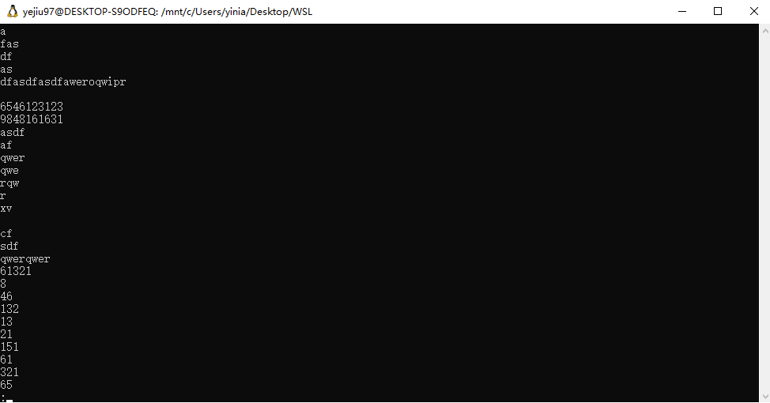

如果我们为 cat 提供多个文件，它将连接它们的内容并输出它们。

cat和tac的显示恰好相反：


rev则是将内容左右调转：

```
yejiu97@DESKTOP-S9ODFEQ:/mnt/c/Users/yinia/Desktop/WSL$ ls
04  1.txt  2.txt  2_cp.txt  rev.txt  text.txt
yejiu97@DESKTOP-S9ODFEQ:/mnt/c/Users/yinia/Desktop/WSL$ cat rev.txt
12345679
yejiu97@DESKTOP-S9ODFEQ:/mnt/c/Users/yinia/Desktop/WSL$ rev rev.txt
97654321
```

head和tail:

```
yejiu97@DESKTOP-S9ODFEQ:/mnt/c/Users/yinia/Desktop/WSL$ ls
04  1.txt  2.txt  2_cp.txt  rev.txt  text.txt  word.txt
yejiu97@DESKTOP-S9ODFEQ:/mnt/c/Users/yinia/Desktop/WSL$ cat word.txt
1
2
3
4
5
6
7
8
9
10
11
12
13
14
15
16
17
18
19
20
yejiu97@DESKTOP-S9ODFEQ:/mnt/c/Users/yinia/Desktop/WSL$ head word.txt
1
2
3
4
5
6
7
8
9
10
yejiu97@DESKTOP-S9ODFEQ:/mnt/c/Users/yinia/Desktop/WSL$ head -11 word.txt
1
2
3
4
5
6
7
8
9
10
11
yejiu97@DESKTOP-S9ODFEQ:/mnt/c/Users/yinia/Desktop/WSL$ tail word.txt
11
12
13
14
15
16
17
18
19
20
yejiu97@DESKTOP-S9ODFEQ:/mnt/c/Users/yinia/Desktop/WSL$ tail -11 word.txt
10
11
12
13
14
15
16
17
18
19
20
```

wc是wordcount的缩写：

```
yejiu97@DESKTOP-S9ODFEQ:/mnt/c/Users/yinia/Desktop/WSL$ ls
04  1.txt  2.txt  2_cp.txt  rev.txt  text.txt  word.txt
yejiu97@DESKTOP-S9ODFEQ:/mnt/c/Users/yinia/Desktop/WSL$ wc word.txt
19 20 69 word.txt
yejiu97@DESKTOP-S9ODFEQ:/mnt/c/Users/yinia/Desktop/WSL$ wc rev.txt
 1  1 10 rev.txt
yejiu97@DESKTOP-S9ODFEQ:/mnt/c/Users/yinia/Desktop/WSL$ wc text.txt
 40  39 217 text.txt
```

# Redirection

standard input在command的作用之下会有两个可能的结果：

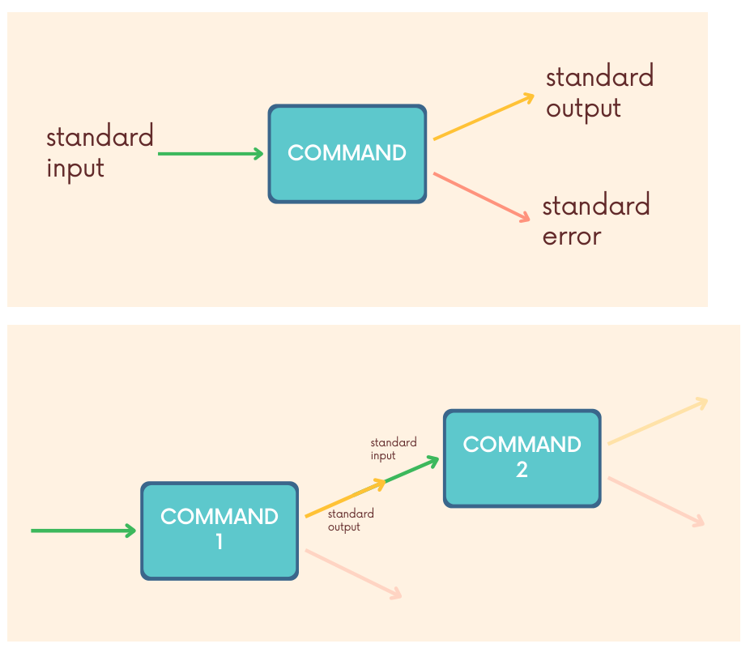

redirection的逻辑为：


重定向输出符号 (>) 告诉 shell 将命令的输出重定向到特定文件而不是屏幕。

以date为例子：

```
yejiu97@DESKTOP-S9ODFEQ:/mnt/c/Users/yinia/Desktop/WSL$ ls
redirection.txt
yejiu97@DESKTOP-S9ODFEQ:/mnt/c/Users/yinia/Desktop/WSL$ date
Mon Dec 19 22:56:50 ACDT 2022
yejiu97@DESKTOP-S9ODFEQ:/mnt/c/Users/yinia/Desktop/WSL$ date > date.txt
yejiu97@DESKTOP-S9ODFEQ:/mnt/c/Users/yinia/Desktop/WSL$ ls
date.txt  redirection.txt
yejiu97@DESKTOP-S9ODFEQ:/mnt/c/Users/yinia/Desktop/WSL$ cat date.txt
Mon Dec 19 22:56:58 ACDT 2022
```

更多的例子：

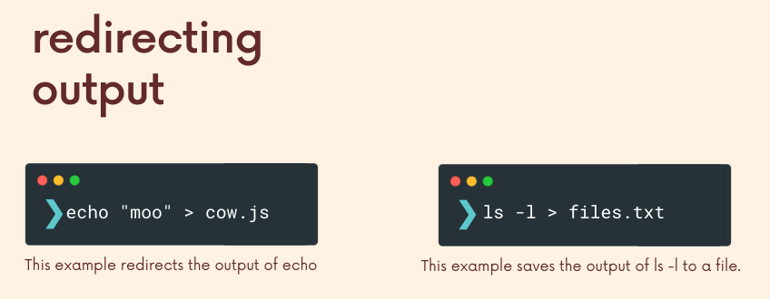

如果向同一个对象中redirection呢？

```
yejiu97@DESKTOP-S9ODFEQ:/mnt/c/Users/yinia/Desktop/WSL$ ls
date.txt  redirection.txt
yejiu97@DESKTOP-S9ODFEQ:/mnt/c/Users/yinia/Desktop/WSL$ echo "Hello" > test.txt
yejiu97@DESKTOP-S9ODFEQ:/mnt/c/Users/yinia/Desktop/WSL$ ls
date.txt  redirection.txt  test.txt
yejiu97@DESKTOP-S9ODFEQ:/mnt/c/Users/yinia/Desktop/WSL$ cat test.txt
Hello
yejiu97@DESKTOP-S9ODFEQ:/mnt/c/Users/yinia/Desktop/WSL$ echo "World" > test.txt
yejiu97@DESKTOP-S9ODFEQ:/mnt/c/Users/yinia/Desktop/WSL$ ls
date.txt  redirection.txt  test.txt
yejiu97@DESKTOP-S9ODFEQ:/mnt/c/Users/yinia/Desktop/WSL$ cat test.txt
World
```

得到的结果如上所示。

如果想要添加而不是覆盖：

```
yejiu97@DESKTOP-S9ODFEQ:/mnt/c/Users/yinia/Desktop/WSL$ echo "Hello" > test.txt
yejiu97@DESKTOP-S9ODFEQ:/mnt/c/Users/yinia/Desktop/WSL$ ls
date.txt  redirection.txt  test.txt
yejiu97@DESKTOP-S9ODFEQ:/mnt/c/Users/yinia/Desktop/WSL$ cat test.txt
Hello
yejiu97@DESKTOP-S9ODFEQ:/mnt/c/Users/yinia/Desktop/WSL$ echo "World" >> test.txt
yejiu97@DESKTOP-S9ODFEQ:/mnt/c/Users/yinia/Desktop/WSL$ ls
date.txt  redirection.txt  test.txt
yejiu97@DESKTOP-S9ODFEQ:/mnt/c/Users/yinia/Desktop/WSL$ cat test.txt
Hello
World
```

可以发现>会导致覆盖，而>>则是导致append。

如果是redirection input，则如下图所示：

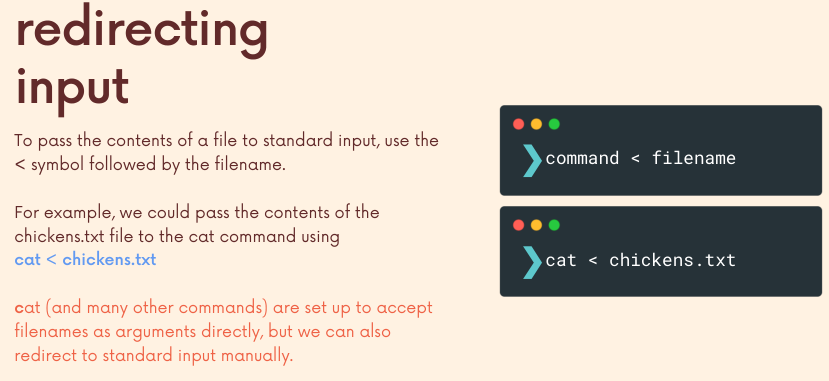

组合如下图所示：

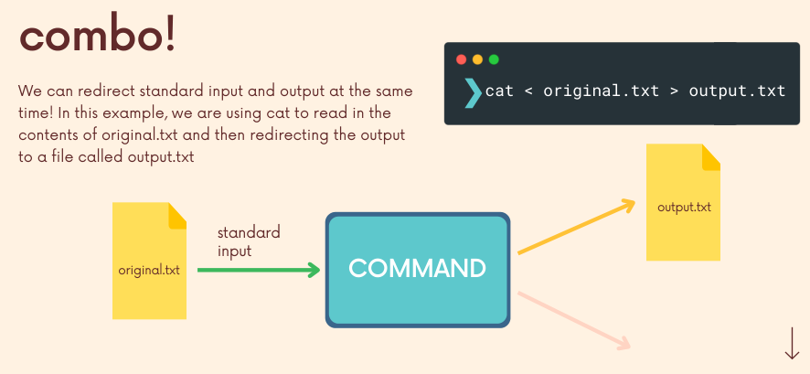

重定向standard error：

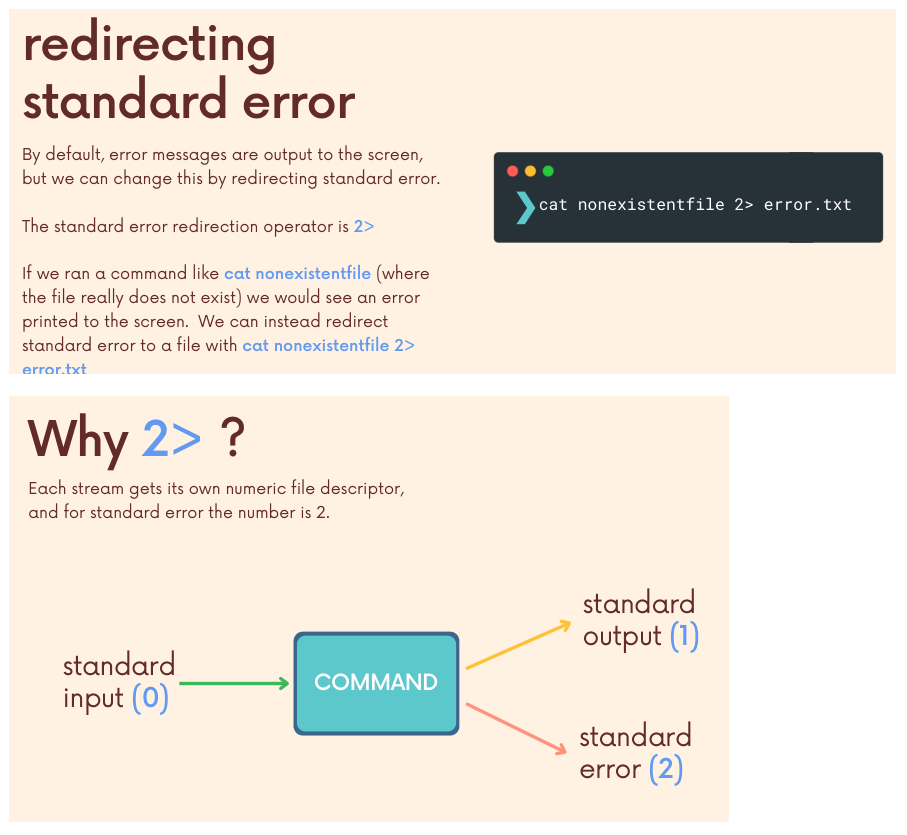

# piping

pipes的作用在于将一个program的结果转给另一个program：

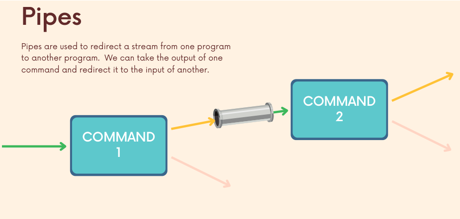

使用 | 来进行pipes。

例子如下所示：

```
total 106244
lrwxrwxrwx 1 root root           4 Feb 18  2020 NF -> col1
-rwxr-xr-x 1 root root      129568 Feb 17  2022 VGAuthService
-rwxr-xr-x 1 root root       51632 Feb  8  2022 [
-rwxr-xr-x 1 root root       35344 Mar 10  2022 aa-enabled
-rwxr-xr-x 1 root root       35344 Mar 10  2022 aa-exec
-rwxr-xr-x 1 root root       31248 Mar 10  2022 aa-features-abi
-rwxr-xr-x 1 root root       14478 Apr 30  2022 add-apt-repository
-rwxr-xr-x 1 root root       14712 Feb 21  2022 addpart
lrwxrwxrwx 1 root root          26 Mar 12  2022 addr2line -> x86_64-linux-gnu-addr2line
-rwxr-xr-x 1 root root        2558 Oct 27  2021 apport-bug
-rwxr-xr-x 1 root root       13367 May 10  2022 apport-cli
lrwxrwxrwx 1 root root          10 May 10  2022 apport-collect -> apport-bug
-rwxr-xr-x 1 root root        2068 May 10  2022 apport-unpack
lrwxrwxrwx 1 root root           6 Mar 18  2022 apropos -> whatis
-rwxr-xr-x 1 root root       18824 Apr  8  2022 apt
lrwxrwxrwx 1 root root          18 Apr 30  2022 apt-add-repository -> add-apt-repository
-rwxr-xr-x 1 root root       84448 Apr  8  2022 apt-cache
-rwxr-xr-x 1 root root       27104 Apr  8  2022 apt-cdrom
-rwxr-xr-x 1 root root       27024 Apr  8  2022 apt-config
-rwxr-xr-x 1 root root       23008 Apr  8  2022 apt-extracttemplates
-rwxr-xr-x 1 root root      236008 Apr  8  2022 apt-ftparchive
-rwxr-xr-x 1 root root       51680 Apr  8  2022 apt-get
-rwxr-xr-x 1 root root       28173 Apr  8  2022 apt-key
-rwxr-xr-x 1 root root       51680 Apr  8  2022 apt-mark
-rwxr-xr-x 1 root root       39320 Apr  8  2022 apt-sortpkgs
lrwxrwxrwx 1 root root          19 Mar 12  2022 ar -> x86_64-linux-gnu-ar
-rwxr-xr-x 1 root root       31232 Feb  8  2022 arch
lrwxrwxrwx 1 root root          19 Mar 12  2022 as -> x86_64-linux-gnu-as
```

另一个例子：

```
yejiu97@DESKTOP-S9ODFEQ:/mnt/c/Users/yinia/Desktop/WSL$ date
Wed Dec 21 13:12:11 ACDT 2022
yejiu97@DESKTOP-S9ODFEQ:/mnt/c/Users/yinia/Desktop/WSL$ date | rev
2202 TDCA 41:21:31 12 ceD deW
```

另一个例子：

```
yejiu97@DESKTOP-S9ODFEQ:/mnt/c/Users/yinia/Desktop/WSL$ ls
date.txt  redirection.txt  test.txt
yejiu97@DESKTOP-S9ODFEQ:/mnt/c/Users/yinia/Desktop/WSL$ ls | wc -l
3
```

以及：

```
yejiu97@DESKTOP-S9ODFEQ:/mnt/c/Users/yinia/Desktop/WSL$ ls
date.txt  redirection.txt  test.txt
yejiu97@DESKTOP-S9ODFEQ:/mnt/c/Users/yinia/Desktop/WSL$ cat date.txt
Mon Dec 19 22:56:58 ACDT 2022
yejiu97@DESKTOP-S9ODFEQ:/mnt/c/Users/yinia/Desktop/WSL$ tac date.txt | rev
2202 TDCA 85:65:22 91 ceD noM
```

我们可以连续使用 | ：

```
yejiu97@DESKTOP-S9ODFEQ:/mnt/c/Users/yinia/Desktop/WSL$ ls
date.txt  pipes.txt  redirection.txt  test.txt
yejiu97@DESKTOP-S9ODFEQ:/mnt/c/Users/yinia/Desktop/WSL$ cat pipes.txt
1
2
3
4
5
6
7
8
9
10
11
12
13
14
15
16
17
18
19
20
21
22
23
24
25
26
27
28
29
30
yejiu97@DESKTOP-S9ODFEQ:/mnt/c/Users/yinia/Desktop/WSL$ cat pipes.txt | head -15 | tail -5
11
12
13
14
15
```

# Expansion

echo是一个非常简单的指令，能够将传输的内容打印出来：

```
yejiu97@DESKTOP-S9ODFEQ:/mnt/c/Users/yinia/Desktop/WSL$ echo hello world
hello world
yejiu97@DESKTOP-S9ODFEQ:/mnt/c/Users/yinia/Desktop/WSL$ echo "hello world"
hello world
```

我们可以使用 * 来将所有的符合条件的文件都栓选出来：

```
yejiu97@DESKTOP-S9ODFEQ:/mnt/c/Users/yinia/Desktop/WSL$ ls
 1  'chicks - 副本 (2).txt'  'chicks - 副本 (3).txt'  'chicks - 副本.txt'   chicks.txt
yejiu97@DESKTOP-S9ODFEQ:/mnt/c/Users/yinia/Desktop/WSL$ ls *.txt
'chicks - 副本 (2).txt'  'chicks - 副本 (3).txt'  'chicks - 副本.txt'   chicks.txt
```

?可以被理解为是一个任意符，一个?就是这几个位置上的内容随意：

```
yejiu97@DESKTOP-S9ODFEQ:/mnt/c/Users/yinia/Desktop/WSL$ ls
 1  'chicks - 副本 (2).txt'  'chicks - 副本 (3).txt'  'chicks - 副本.txt'   chicks.py   chicks.txt
yejiu97@DESKTOP-S9ODFEQ:/mnt/c/Users/yinia/Desktop/WSL$ ls chicks.??
chicks.py
```

我们可以使用[?~?]的方式来将符合的文件都选出来：

```
yejiu97@DESKTOP-S9ODFEQ:/mnt/c/Users/yinia/Desktop/WSL$ ls
1  1.txt  2.txt  3.txt  4.txt
yejiu97@DESKTOP-S9ODFEQ:/mnt/c/Users/yinia/Desktop/WSL$ ls [1-9].txt
1.txt  2.txt  3.txt  4.txt
```

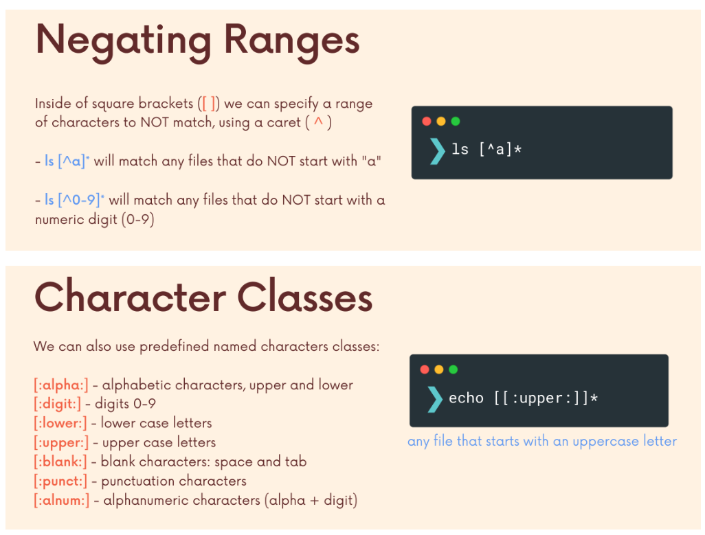

同样的：

```
yejiu97@DESKTOP-S9ODFEQ:/mnt/c/Users/yinia/Desktop/WSL$ ls
1  1.txt  2.txt  3.txt  4.txt
yejiu97@DESKTOP-S9ODFEQ:/mnt/c/Users/yinia/Desktop/WSL$ touch {1,2,3,4,5,6,7,8,9}.txt
yejiu97@DESKTOP-S9ODFEQ:/mnt/c/Users/yinia/Desktop/WSL$ ls
1  1.txt  2.txt  3.txt  4.txt  5.txt  6.txt  7.txt  8.txt  9.txt
```

以及：

```
yejiu97@DESKTOP-S9ODFEQ:/mnt/c/Users/yinia/Desktop/WSL$ ls
1  1.txt  2.txt  3.txt  4.txt  5.txt  6.txt  7.txt  8.txt  9.txt
yejiu97@DESKTOP-S9ODFEQ:/mnt/c/Users/yinia/Desktop/WSL$ rm [^7]*.txt
yejiu97@DESKTOP-S9ODFEQ:/mnt/c/Users/yinia/Desktop/WSL$ ls
1  7.txt
```

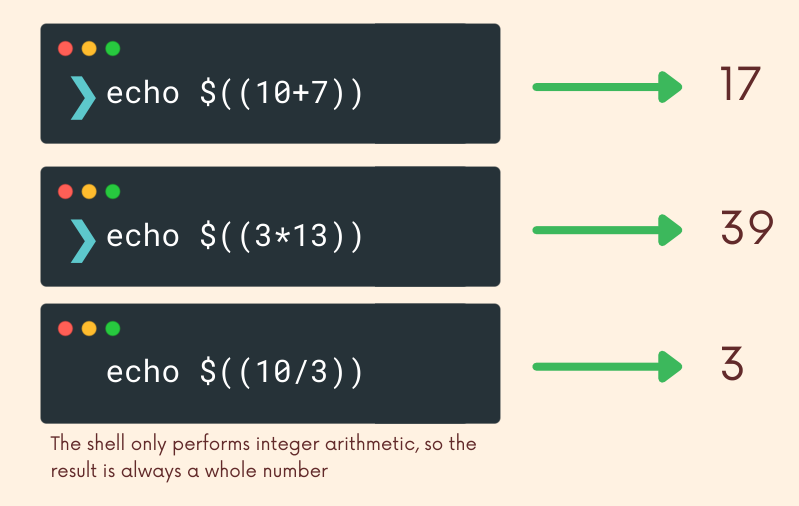

```
yejiu97@DESKTOP-S9ODFEQ:/mnt/c/Users/yinia/Desktop/WSL$ echo "Now is $(date)"
Now is Thu Dec 22 12:39:55 ACDT 2022
yejiu97@DESKTOP-S9ODFEQ:/mnt/c/Users/yinia/Desktop/WSL$ echo "$5.00"
.00
yejiu97@DESKTOP-S9ODFEQ:/mnt/c/Users/yinia/Desktop/WSL$ echo "\$5.00"
$5.00
```

# Finding

## locate

使用locate可以找到所有匹配的文件的位置：

```
yejiu97@DESKTOP-S9ODFEQ:/mnt/c/Users/yinia/Desktop/WSL$ ls
1  chicks.txt
yejiu97@DESKTOP-S9ODFEQ:/mnt/c/Users/yinia/Desktop/WSL$ cd 1
yejiu97@DESKTOP-S9ODFEQ:/mnt/c/Users/yinia/Desktop/WSL/1$ ls
2  chicks.txt
yejiu97@DESKTOP-S9ODFEQ:/mnt/c/Users/yinia/Desktop/WSL/1$ cd 2
yejiu97@DESKTOP-S9ODFEQ:/mnt/c/Users/yinia/Desktop/WSL/1/2$ ls
chicks.txt
yejiu97@DESKTOP-S9ODFEQ:/mnt/c/Users/yinia/Desktop/WSL/1/2$ cd ..
yejiu97@DESKTOP-S9ODFEQ:/mnt/c/Users/yinia/Desktop/WSL/1$ cd ..
yejiu97@DESKTOP-S9ODFEQ:/mnt/c/Users/yinia/Desktop/WSL$ ls
1  chicks.txt
yejiu97@DESKTOP-S9ODFEQ:/mnt/c/Users/yinia/Desktop/WSL$ locate chicks
Command 'locate' not found, but can be installed with:
sudo apt install plocate
yejiu97@DESKTOP-S9ODFEQ:/mnt/c/Users/yinia/Desktop/WSL$ sudo apt install plocate
[sudo] password for yejiu97:
Reading package lists... Done
Building dependency tree... Done
Reading state information... Done
The following package was automatically installed and is no longer required:
  libfreetype6
Use 'sudo apt autoremove' to remove it.
The following additional packages will be installed:
  liburing2
The following NEW packages will be installed:
  liburing2 plocate
0 upgraded, 2 newly installed, 0 to remove and 70 not upgraded.
Need to get 140 kB of archives.
After this operation, 555 kB of additional disk space will be used.
Do you want to continue? [Y/n] y
Get:1 http://archive.ubuntu.com/ubuntu jammy/main amd64 liburing2 amd64 2.1-2build1 [10.3 kB]
Get:2 http://archive.ubuntu.com/ubuntu jammy/main amd64 plocate amd64 1.1.15-1ubuntu2 [129 kB]
Fetched 140 kB in 2s (62.6 kB/s)
Selecting previously unselected package liburing2:amd64.
(Reading database ... 33883 files and directories currently installed.)
Preparing to unpack .../liburing2_2.1-2build1_amd64.deb ...
Unpacking liburing2:amd64 (2.1-2build1) ...
Selecting previously unselected package plocate.
Preparing to unpack .../plocate_1.1.15-1ubuntu2_amd64.deb ...
Unpacking plocate (1.1.15-1ubuntu2) ...
Setting up liburing2:amd64 (2.1-2build1) ...
Setting up plocate (1.1.15-1ubuntu2) ...
update-alternatives: using /usr/bin/plocate to provide /usr/bin/locate (locate) in auto mode
Adding group `plocate' (GID 120) ...
Done.
Initializing plocate database; this may take some time... done
Created symlink /etc/systemd/system/timers.target.wants/plocate-updatedb.timer → /lib/systemd/system/plocate-updatedb.timer.
Processing triggers for man-db (2.10.2-1) ...
Processing triggers for libc-bin (2.35-0ubuntu3) ...
Scanning processes...
Scanning candidates...
Scanning processor microcode...
Scanning linux images...

Failed to retrieve available kernel versions.

Failed to check for processor microcode upgrades.

No services need to be restarted.

No containers need to be restarted.

User sessions running outdated binaries:
 root @ /dev/pts/0: apt[36,138], sh[143]
 root @ /dev/tty1: init[8]
 yejiu97 @ /dev/tty1: bash[9]

No VM guests are running outdated hypervisor (qemu) binaries on this host.
yejiu97@DESKTOP-S9ODFEQ:/mnt/c/Users/yinia/Desktop/WSL$ locate chicks
/mnt/c/Users/yinia/AppData/Roaming/Microsoft/Windows/Recent/chicks.txt.lnk
/mnt/c/Users/yinia/Desktop/WSL/chicks.txt
/mnt/c/Users/yinia/Desktop/WSL/1/chicks.txt
/mnt/c/Users/yinia/Desktop/WSL/1/2/chicks.txt
yejiu97@DESKTOP-S9ODFEQ:/mnt/c/Users/yinia/Desktop/WSL$
```

locate可以提供参数：

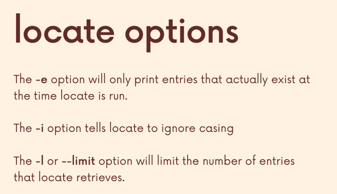

## find


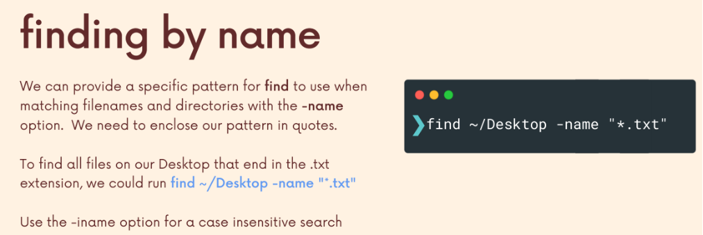

## counting results

```
yejiu97@DESKTOP-S9ODFEQ:/mnt/c/Users/yinia/Desktop/WSL$ find -name "*.txt" | wc -l
3
```

## finding by

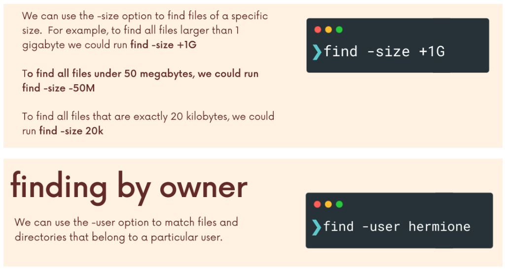

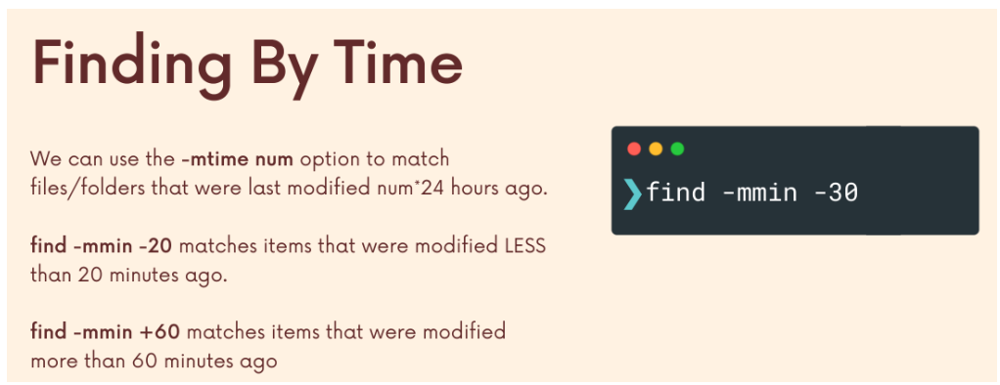

# Grep

grep 命令在每个文件的内容中搜索模式。 Grep 将打印与我们提供的模式匹配的每一行。

grep “chicken” animals.txt 将打印 animals.txt 文件中包含模式 “chicken” 的每一行：


# Permissions Basics

Unix and unix-like systems are multiuser operating systems.

例子：

```
yejiu97@DESKTOP-S9ODFEQ:/mnt/c/Users/yinia/Desktop/WSL$ cat /etc/sudoers
cat: /etc/sudoers: Permission denied
```


查看自己的id：

```
yejiu97@DESKTOP-S9ODFEQ:/mnt/c/Users/yinia/Desktop/WSL$ id
uid=1000(yejiu97) gid=1000(yejiu97) groups=1000(yejiu97),4(adm),20(dialout),24(cdrom),25(floppy),27(sudo),29(audio),30(dip),44(video),46(plugdev),118(netdev)
```

我们可以看这样的一个例子：

```
yejiu97@DESKTOP-S9ODFEQ:/mnt/c/Users/yinia/Desktop/WSL$ echo "hi" > greet.txt
yejiu97@DESKTOP-S9ODFEQ:/mnt/c/Users/yinia/Desktop/WSL$ ls -l greet.txt
-rwxrwxrwx 1 yejiu97 yejiu97 3 Dec 22 12:55 greet.txt
```

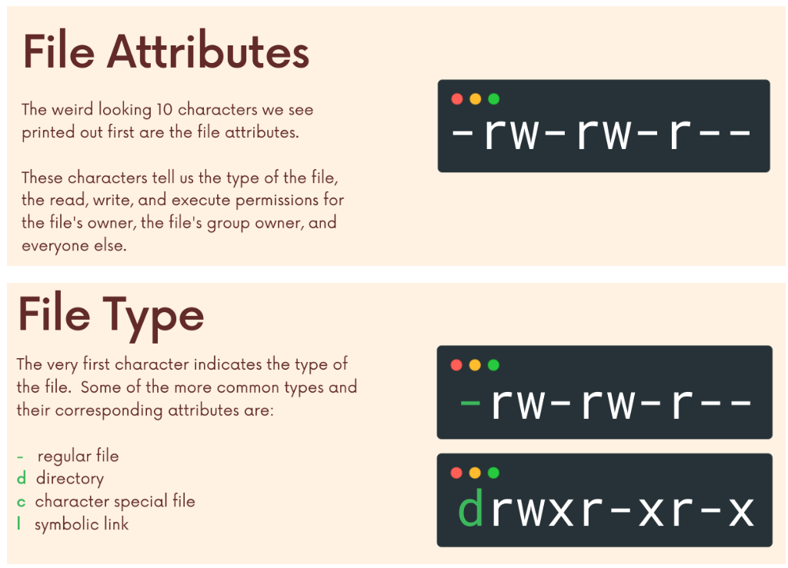

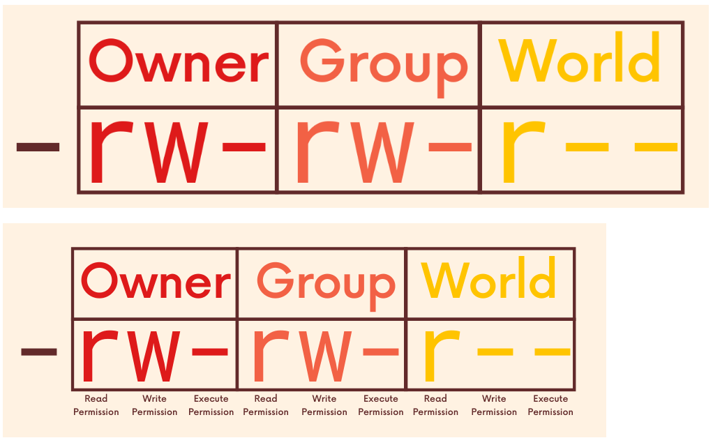


# 更改权限

## 文件权限

要更改文件或目录的权限，我们可以使用 chmod 命令（更改模式）。

要使用 chmod 更改权限，我们需要告诉它：

- 我们正在为谁更改权限
- 我们正在做出什么改变？ 添加？ 删除？
- 我们正在设置哪些权限？


在使用 chmod 指定权限时，我们使用特殊的语法来编写权限语句。

首先要确认的是是谁：

```
u - 用户（文件的所有者）
g - 组（文件所属组的成员
o - 其他（“世界”）
a - 以上所有
```

接着要确认的是做什么：

```
-（减号）删除权限
+（加号）授予权限
=（等号）设置权限并删除其他权限
```

最后要确认的是哪个值：

```
r - 读取权限
w - 写权限
x - 执行权限
```

这是一个例子：

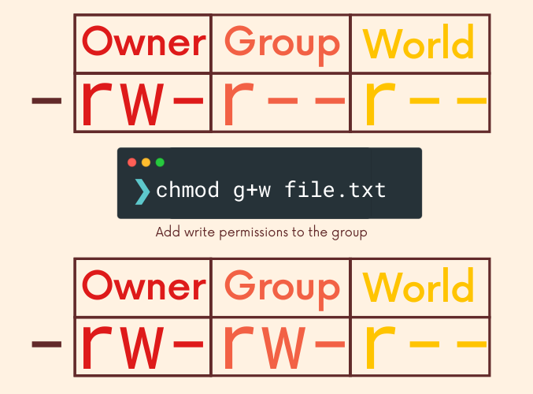

这是另一个例子：

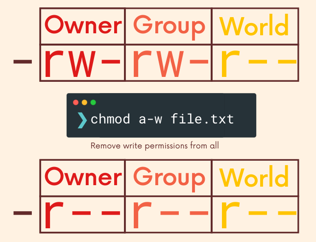

以及：

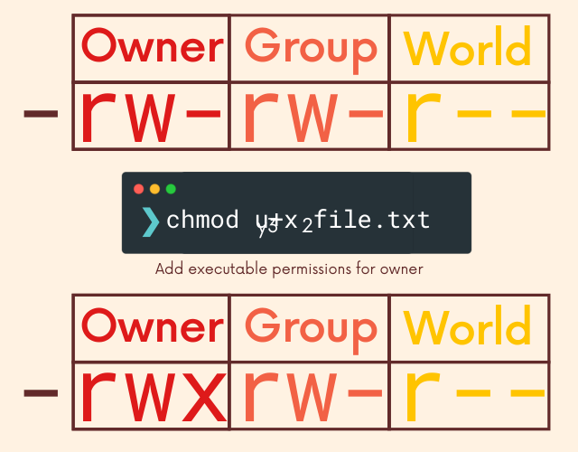

还有：


## 改变身份

有时我们可能想从我们自己的 shell 会话中以另一个用户的身份启动 shell。

我们可以使用 su 命令来做到这一点。

```
例如，su - hermione 将为用户 hermione 创建一个新的登录 shell。
```

我们需要输入赫敏的密码。 要离开会话，请键入 exit。

在Linux系统中，有一个超级用户叫做root。 root 用户可以运行任何命令并访问机器上的任何文件，无论文件的实际所有者如何。 root 用户拥有巨大的权力，很容易通过运行错误的命令来破坏甚至破坏系统！ 为此，Ubuntu 默认锁定了 root 用户。

使用sudo -l来进行查看：

```
yejiu97@DESKTOP-S9ODFEQ:/mnt/c/Users/yinia/Desktop/WSL$ sudo -l
Matching Defaults entries for yejiu97 on DESKTOP-S9ODFEQ:
    env_reset, mail_badpass, secure_path=/usr/local/sbin\:/usr/local/bin\:/usr/sbin\:/usr/bin\:/sbin\:/bin\:/snap/bin,
    use_pty

User yejiu97 may run the following commands on DESKTOP-S9ODFEQ:
    (ALL : ALL) ALL
```

sudo既是将接下来的指令按照root权限来进行运行。

chown可以将特定的文件或者文件夹的owner或者group修改掉：

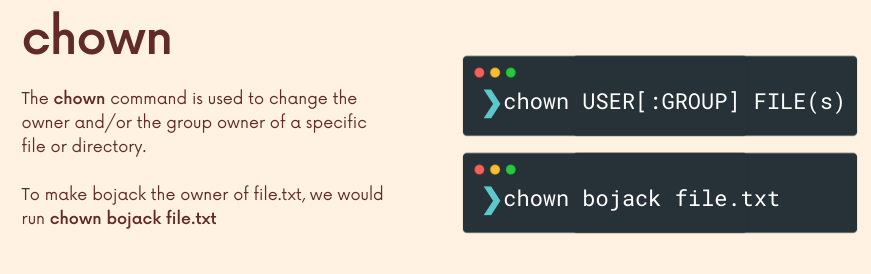

# 写一个自己的command

首先需要进入到bin文件夹中：

```
yejiu97@DESKTOP-S9ODFEQ:/$ ls
bin   dev  home  lib    lib64   media  opt   root  sbin  srv  tmp  var
boot  etc  init  lib32  libx32  mnt    proc  run   snap  sys  usr
yejiu97@DESKTOP-S9ODFEQ:/$ cd usr
yejiu97@DESKTOP-S9ODFEQ:/usr$ ls
bin  games  include  lib  lib32  lib64  libexec  libx32  local  sbin  share  src
yejiu97@DESKTOP-S9ODFEQ:/usr$ cd local
yejiu97@DESKTOP-S9ODFEQ:/usr/local$ ls
bin  etc  games  include  lib  man  sbin  share  src
yejiu97@DESKTOP-S9ODFEQ:/usr/local$ ls
bin  etc  games  include  lib  man  sbin  share  src
yejiu97@DESKTOP-S9ODFEQ:/usr/local$ cd bin
yejiu97@DESKTOP-S9ODFEQ:/usr/local/bin$ ls
yejiu97@DESKTOP-S9ODFEQ:/usr/local/bin$
```

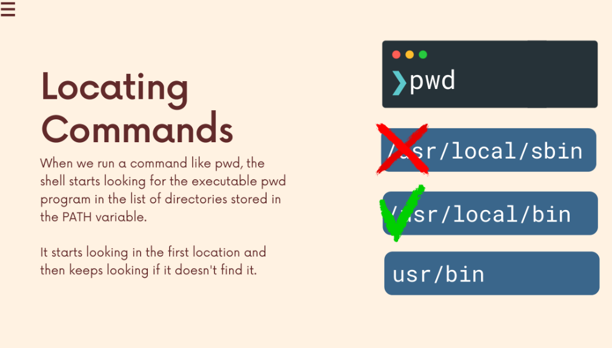

# 虚拟机安装

访问网站：

[Oracle VM VirtualBox](https://www.virtualbox.org/)

在右侧找到download：

[Downloads - Oracle VM VirtualBox](https://www.virtualbox.org/wiki/Downloads)

将对应的内容下载下来：

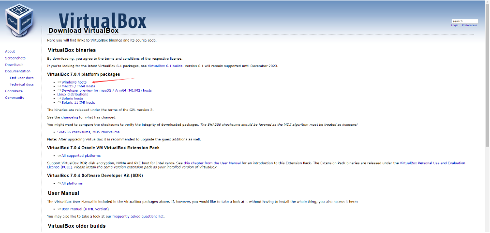

接着访问：

[Enterprise Open Source and Linux | Ubuntu](https://ubuntu.com/)

然后进行下载：

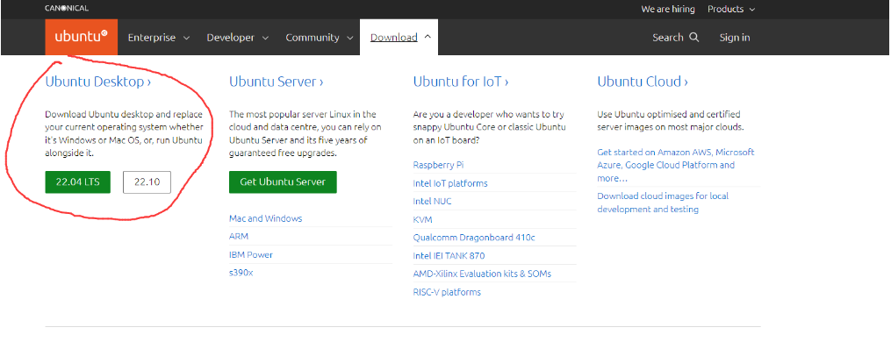

然后将其导入：

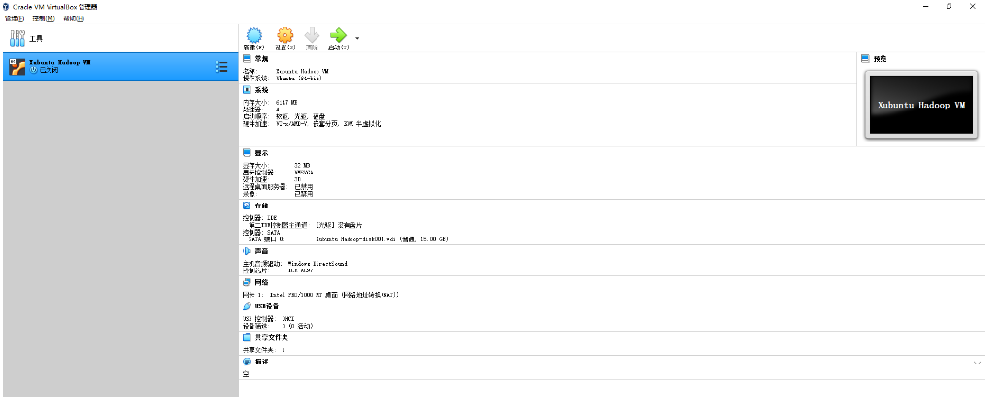